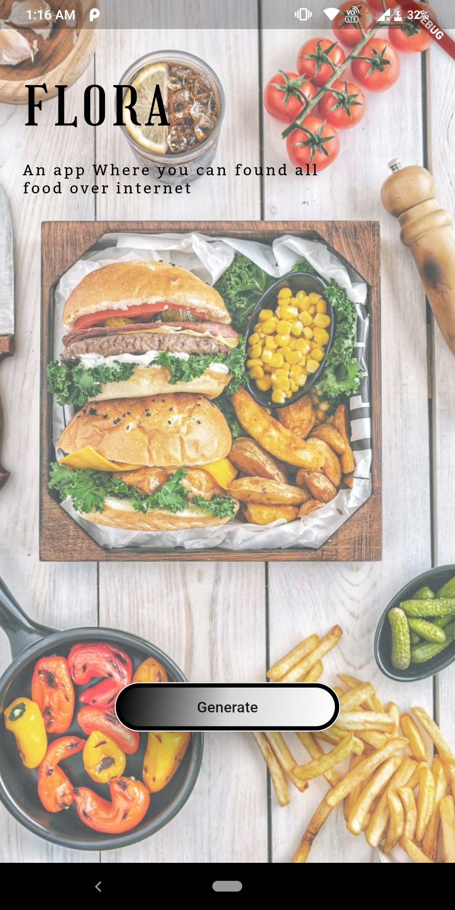

# FLORA(A Fitness App)

A new Flutter project.
This app is made with help of flutter
And can predict you a meal according to your diet
It can provide you with random recipies which you can try at your homes

It alos tries to measure distance you cover daily using a podometer (This is not at all accurate)

## Some Images
</img>
</img>
</img>
</img>
</img>
</img>
</img>
</img>
</img>

This app is still not complete but it can be used
## Getting Started

This project is a starting point for a Flutter application.

Thanks to spoonacular.com for such good food api

A few resources to get you started if this is your first Flutter project:

- [Lab: Write your first Flutter app](https://flutter.dev/docs/get-started/codelab)
- [Cookbook: Useful Flutter samples](https://flutter.dev/docs/cookbook)

For help getting started with Flutter, view our
[online documentation](https://flutter.dev/docs), which offers tutorials,
samples, guidance on mobile development, and a full API reference.
